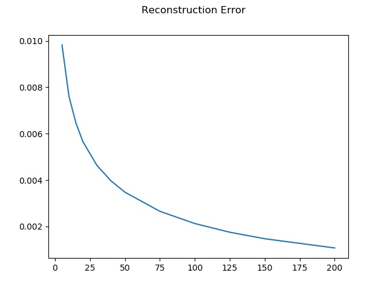
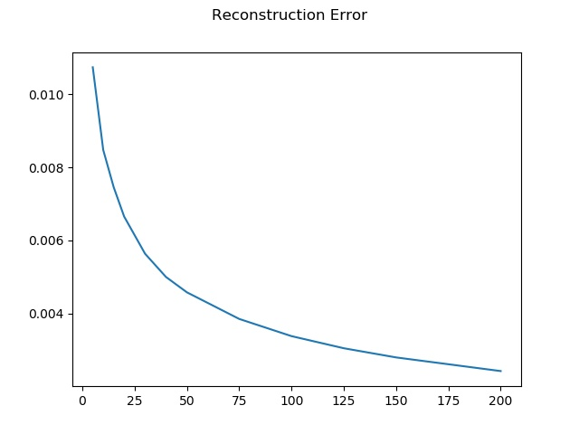

# Principal-Component-Analysis
Demonstration of PCA using Celebrities face datasets

Reconstructed faces using 200 dimensions instead of 6084 original dimensions.

Training images

Testing images

Trainig reconstruction error

Testing reconstruction error

Full report in [report.pdf](report.pdf) and Solution in [PCA.py](PCA.py).
